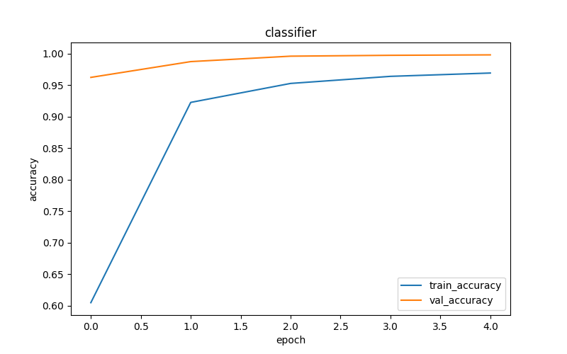
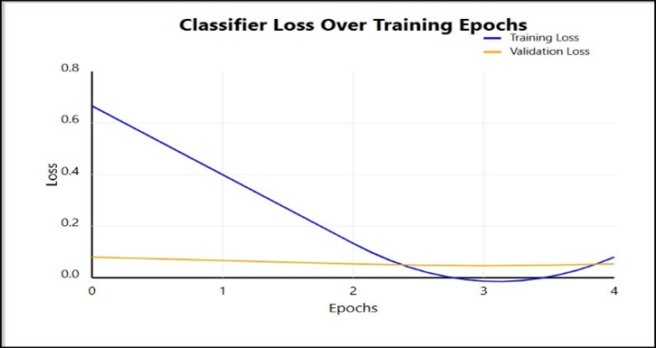
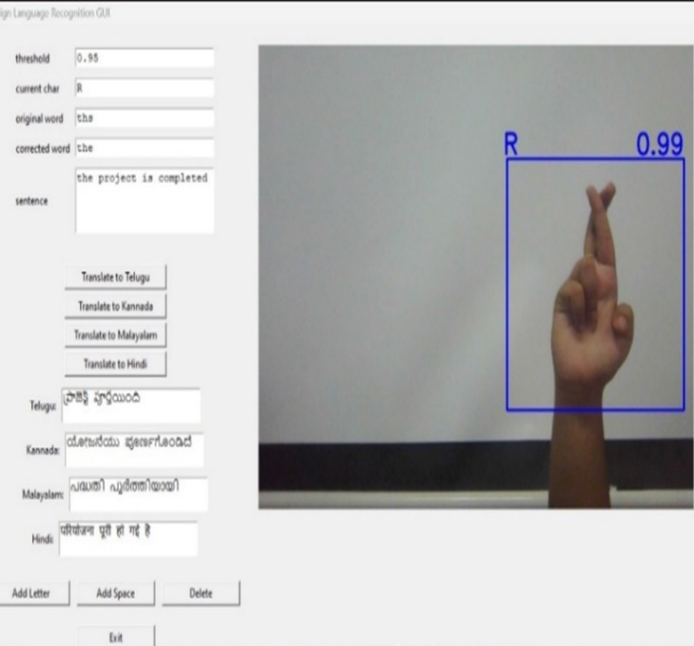

---

````markdown
#  ASL to Indian Regional Languages Translator

A real-time hand gesture detection and translation system for **American Sign Language (ASL)** that bridges communication gaps by translating ASL to **text** and then into multiple **Indian regional languages** such as Kannada, Telugu, Malayalam, and Hindi.

---

## 🧠 Project Overview

This project leverages **Convolutional Neural Networks (CNNs)** networks to identify static ASL gestures using a webcam. Detected signs are translated into English text and further into regional Indian languages using the **Google Translate API**.

---

## 🎯 Features

- 🔤 ASL hand gesture recognition
- 🧠 CNN for static gestures (A-Z, space, delete, nothing)
- 📹 Real-time webcam integration via **OpenCV**
- ✋ Hand tracking using **MediaPipe**
- ✅ Confidence filtering (≥ 95%)
- 🛠 Spell correction with **PySpellChecker**
- 🌐 Translation into Indian languages using **Google Translate API**
- 🖥 GUI built with **Tkinter**

---

## 🛠 Architecture

### System Modules:
1. **Input Module**: Webcam + MediaPipe for hand landmark detection
2. **Preprocessing**: Gaussian blur, adaptive thresholding, normalization
3. **Classification**:
   - CNN (Static Gestures)
4. **Post-processing**: Confidence filtering + spell correction
5. **Output**: Real-time interface + translation dropdown

---

## 📦 Requirements

Install dependencies using:

```bash
pip install -r requirements.txt
````

### `requirements.txt`

```text
opencv-python
mediapipe
tensorflow
keras
numpy
pandas
pyspellchecker
googletrans==4.0.0rc1
tk
matplotlib
```

---

## 🚀 How to Run

1. Clone the repository:

```bash
git clone https://github.com/ShreyaaSMKud/asl-translation.git
cd asl-translation
```

2. Install requirements:

```bash
pip install -r requirements.txt
```

3. Run the application:

```bash
python aslFinal.py
```


---

## 📊 Performance

| Model                   | Accuracy | Latency  |
| ----------------------- | -------- | -------- |
| CNN (Static Gestures)   | \~99%    | Very Low |


---

## 🌍 Supported Languages

* Kannada
* Telugu
* Malayalam
* Hindi

Translation is handled via **Google Translate API**.

---

## 📁 Dataset

* **ASL Alphabet Dataset** from [Kaggle](https://www.kaggle.com/datasets/grassknoted/asl-alphabet)


---

## 📸 Screenshots

### Accuracy Graph


### Loss Graph


### Demo


---

## 🧑‍💻 Authors

* Ms. Shreyaa S M Kudremane
* Ms. Varnitha Venkatesh
* Ms. Ritika S Nair
* Ms. Vismitha H

---

## 📄 License

MIT License — see the [LICENSE](LICENSE) file for details.

---


---

## 🚧 Future Enhancements

* Integration with facial expression and body posture detection
* Voice synthesis (text-to-speech) for translated output
* Mobile deployment via TensorFlow Lite

```


